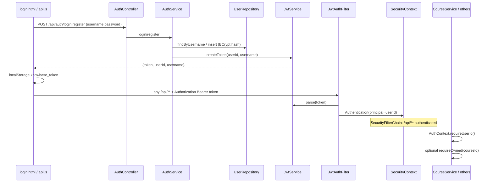

## Short answer
Knowbase uses **stateless JWT (Bearer)**: `POST /api/auth/register|login` issue a signed token (`sub` = userId); `JwtAuthFilter` parses `Authorization: Bearer …` into Spring `SecurityContext`; services read the principal via `AuthContext.requireUserId()`. Only `/api/auth/**` and CORS `OPTIONS /**` are public API paths; every other `/api/**` requires authentication, then course APIs additionally check ownership via `CourseService.requireOwned`.

## Key files
| Path | Role |
|------|------|
| `backend/src/main/java/com/ailab/auth/AuthController.java` | Public `POST /api/auth/register`, `/login` |
| `backend/src/main/java/com/ailab/auth/AuthService.java` | Validate creds, BCrypt hash, issue JWT payload map |
| `backend/src/main/java/com/ailab/auth/JwtService.java` | Create/parse HS JWT (`sub`=userId, claim `username`) |
| `backend/src/main/java/com/ailab/auth/JwtAuthFilter.java` | Bearer → `SecurityContext` principal = userId |
| `backend/src/main/java/com/ailab/auth/AuthContext.java` | `requireUserId()` from `SecurityContextHolder` |
| `backend/src/main/java/com/ailab/auth/UserRepository.java` | SQLite `users` CRUD |
| `backend/src/main/java/com/ailab/config/SecurityConfig.java` | Filter chain, permitAll rules, BCrypt bean, CORS |
| `backend/src/main/java/com/ailab/common/ApiExceptionHandler.java` | `SecurityException` → 403 `{error}` |
| `backend/src/main/java/com/ailab/course/CourseService.java` | `AuthContext` + `requireOwned(courseId)` |
| `backend/src/main/java/com/ailab/db/SchemaInitializer.java` | `users` table schema |
| `backend/src/main/resources/application.yml` | `app.auth.jwt-secret`, `jwt-expiration-ms` (24h) |
| `frontend/js/api.js` | `localStorage` token + `Authorization` header |
| `frontend/login.html` | UI login/register → `setAuth` → `/courses.html` |

## Flow

1. **Register** (`AuthService.register`): username non-blank, password ≥ 4; reject duplicate; UUID id; `PasswordEncoder` (BCrypt) hash; insert `users`; JWT; return `{token, userId, username}`.
2. **Login** (`AuthService.login`): lookup by trimmed username; `passwordEncoder.matches`; same JWT response shape. Wrong creds → `IllegalArgumentException` → 400.
3. **JWT** (`JwtService`): JJWT, HMAC key from `app.auth.jwt-secret` (padded to 32 bytes if shorter); `subject` = userId; claim `username`; TTL `app.auth.jwt-expiration-ms` = `86400000` (24h).
4. **Request auth** (`JwtAuthFilter`): if `Authorization` starts with `Bearer `, parse claims; set `UsernamePasswordAuthenticationToken(userId, null, empty authorities)`; on parse failure clear context and continue (no early 401 from filter).
5. **Gate** (`SecurityConfig.filterChain`): CSRF off, sessions `STATELESS`, filter before `UsernamePasswordAuthenticationFilter`. Matchers: `/api/auth/**` + `OPTIONS /**` → `permitAll`; `/api/**` → `authenticated`; everything else → `permitAll`.
6. **userId in app code**: Controllers do **not** take `@AuthenticationPrincipal`. They call services; services (or `StatsController`) call `AuthContext.requireUserId()`, which reads `SecurityContext` principal as `String`. Missing/invalid auth type → `SecurityException("Требуется авторизация")` → **403**.
7. **Ownership**: course-scoped work uses `CourseService.requireOwned(courseId)` (userId from `AuthContext` + `courses.user_id` match); used by `LectureService`, `AskService`, `ConspectService`, `CourseOutlineService`, and directly in `LectureController` corpus build.
8. **Frontend**: `login.html` posts to `/api/auth/${mode}`; `setAuth` stores token; `api()` attaches Bearer; `requireAuth()` redirects to `/login.html` if no token. Vite proxies `/api` to `:8081`.

## Relationships
- **Public API:** only `POST /api/auth/register`, `POST /api/auth/login` (matcher `/api/auth/**`). Plus all `OPTIONS` for CORS.
- **Protected API:** all other `/api/**` — courses, lectures, materials, corpus, outline, conspect, ask, stats, `GET /api/lectures/{id}`, etc. Spring enforces JWT presence; domain layer enforces ownership.
- **Non-API:** `anyRequest().permitAll()` — backend does not protect static/UI (UI is Vite on 5173).
- **Auth vs ownership:** authentication = valid JWT principal; authorization for courses = `requireOwned` / list-by-userId. Controllers stay thin; exception: `StatsController` reads `AuthContext` itself.
- **Errors:** bad login/validation → 400; duplicate user → 409 (`IllegalStateException`); `SecurityException` → 403. Unauthenticated `/api/**` without usable principal → Spring Security **401** (filter does not write body on bad token).

## Tests & gaps
- **No auth tests** under `backend/src/test` (only `CitationTimestampTest`, `ChunkerTest`).
- Gaps: register/login happy-path & validation; JWT create/parse/expiry; filter sets/clears context; `SecurityConfig` public vs protected; `AuthContext.requireUserId`; ownership deny for foreign `courseId`; frontend token attach / redirect.

## Conclusions
- JWT flow is classic: issue at auth endpoints → Bearer filter → `SecurityContext` → `AuthContext.requireUserId()` in services.
- Participating types: `AuthController`, `AuthService`, `UserRepository`, `JwtService`, `JwtAuthFilter`, `AuthContext`, `SecurityConfig` (+ `PasswordEncoder`, `ApiExceptionHandler`).
- Controllers get `userId` indirectly via services/`AuthContext`, not request DTOs.
- Public paths: `/api/auth/**`, `OPTIONS /**`; all other `/api/**` authenticated; non-`/api` permitted on the backend.
- Advisory: add auth/security tests; consider rejecting invalid Bearer with explicit 401 in the filter instead of “clear and fall through”.
