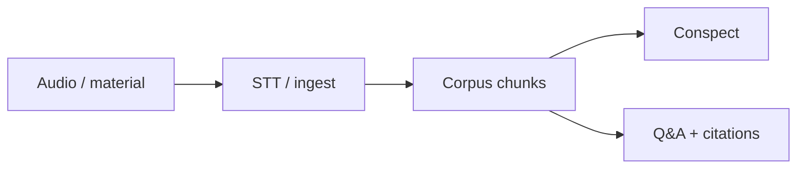

# Knowbase architecture

## Stack

- **Backend:** Java 17, Spring Boot 3.4, SQLite (`JdbcTemplate`), JWT auth, Spring AI / OpenRouter (chat + Whisper STT)
- **Frontend:** Vite + vanilla JS (no React/TypeScript)
- **Ports:** API `8081`, UI `5173`
- **Secrets:** `application-local.yml` / env only (never committed)

## Packages (`com.ailab.*`)

| Package | Role |
|---------|------|
| `auth` | Register/login, JWT, `AuthContext`, filter |
| `course` | Course CRUD, ownership, outline, AI aggregate routes |
| `lecture` | Audio upload, materials (`source_type=MATERIAL`), STT jobs |
| `corpus` | Chunking, corpus build, `ChunkRepository` |
| `conspect` | Conspect generate/get/export |
| `qa` | Ask with citations |
| `stt` / `llm` | Transcription client, LLM gateway |
| `stats` | User-level stats |
| `db` / `common` / `config` | Schema, exception handler, security |

Layers: **Controller → Service → Repository**. Materials are `lectures` rows with `source_type = MATERIAL`.

## Ownership rule

Every course-scoped operation starts with `CourseService.requireOwned(courseId)`:

1. Resolve current user via `AuthContext.requireUserId()`
2. Load course; missing → `IllegalArgumentException` (“Курс не найден”)
3. Wrong owner → `SecurityException` (“Нет доступа к курсу”) → HTTP **403**

`CourseService` stays CRUD + ownership only; aggregates live in dedicated services (e.g. `CourseOutlineService`, `ConspectService`, `AskService`).

## Main flow

1. **Auth** — register/login → Bearer JWT on `/api/**` (except `/api/auth/**`, `/api/health`)
2. **Course** — create course; upload lecture audio and/or text materials
3. **STT** — audio → transcript stored on the lecture
4. **Corpus** — `POST .../corpus/build` chunks lecture/material text into `chunks`
5. **Conspect** — LLM summary from corpus; optional Markdown export
6. **Ask** — question over chunks → answer + timestamped citations

## Out of scope (forbidden)

**Concept-map** features (endpoints, tables, UI) are **out of scope and forbidden** — do not implement a concept map or video pipeline.
